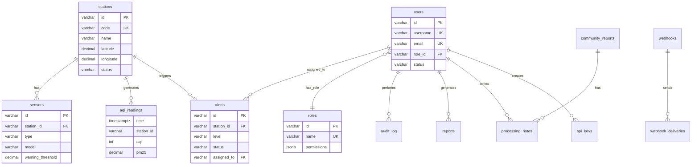

# Database Schema — Urban Air Quality Platform

## 1. PostgreSQL — Dữ liệu nghiệp vụ

### stations

```sql
CREATE TABLE stations (
    id              VARCHAR(20)  PRIMARY KEY,
    code            VARCHAR(20)  UNIQUE NOT NULL,
    name            VARCHAR(100) NOT NULL,
    district        VARCHAR(50),
    address         VARCHAR(255),
    latitude        DECIMAL(10,6) NOT NULL,
    longitude       DECIMAL(10,6) NOT NULL,
    type            VARCHAR(20)  NOT NULL DEFAULT 'fixed',  -- fixed | mobile | satellite
    status          VARCHAR(20)  NOT NULL DEFAULT 'offline', -- online | offline | maintenance | decommissioned
    operating_org   VARCHAR(100),
    installed_date  DATE,
    mqtt_topic      VARCHAR(100) UNIQUE,
    last_data_at    TIMESTAMPTZ,
    created_at      TIMESTAMPTZ  DEFAULT NOW(),
    updated_at      TIMESTAMPTZ  DEFAULT NOW()
);

CREATE INDEX idx_stations_district ON stations(district);
CREATE INDEX idx_stations_status ON stations(status);
CREATE INDEX idx_stations_type ON stations(type);
```

### sensors

```sql
CREATE TABLE sensors (
    id                VARCHAR(20)  PRIMARY KEY,
    station_id        VARCHAR(20)  NOT NULL REFERENCES stations(id),
    type              VARCHAR(20)  NOT NULL,  -- PM2.5 | PM10 | CO | NO2 | SO2 | O3 | temperature | humidity | wind_speed | wind_direction
    model             VARCHAR(50),
    serial_number     VARCHAR(50)  UNIQUE,
    unit              VARCHAR(20),
    warning_threshold DECIMAL(10,2),
    critical_threshold DECIMAL(10,2),
    calibrated_at     DATE,
    next_calibration  DATE,
    status            VARCHAR(20)  DEFAULT 'active',  -- active | faulty | decommissioned
    created_at        TIMESTAMPTZ  DEFAULT NOW()
);

CREATE INDEX idx_sensors_station ON sensors(station_id);
CREATE INDEX idx_sensors_type ON sensors(type);
```

### users

```sql
CREATE TABLE users (
    id              VARCHAR(20)  PRIMARY KEY,
    username        VARCHAR(50)  UNIQUE NOT NULL,
    email           VARCHAR(100) UNIQUE NOT NULL,
    password_hash   VARCHAR(255) NOT NULL,
    full_name       VARCHAR(100) NOT NULL,
    phone           VARCHAR(20),
    avatar_url      VARCHAR(255),
    role_id         VARCHAR(20)  REFERENCES roles(id),
    department      VARCHAR(50),
    status          VARCHAR(20)  DEFAULT 'active',  -- active | inactive | locked
    last_login_at   TIMESTAMPTZ,
    login_attempts  INT          DEFAULT 0,
    locked_until    TIMESTAMPTZ,
    created_at      TIMESTAMPTZ  DEFAULT NOW(),
    updated_at      TIMESTAMPTZ  DEFAULT NOW()
);

CREATE INDEX idx_users_role ON users(role_id);
CREATE INDEX idx_users_status ON users(status);
```

### roles

```sql
CREATE TABLE roles (
    id              VARCHAR(20)  PRIMARY KEY,
    name            VARCHAR(50)  UNIQUE NOT NULL,
    display_name    VARCHAR(100),
    description     TEXT,
    permissions     JSONB        NOT NULL DEFAULT '{}',
    is_system       BOOLEAN      DEFAULT FALSE,
    created_at      TIMESTAMPTZ  DEFAULT NOW()
);

-- permissions JSON structure:
-- { "stations": ["view","create","edit","delete","export"],
--   "aqi": ["view","export"],
--   "alerts": ["view","create","close"] }
```

### alerts

```sql
CREATE TABLE alerts (
    id              VARCHAR(20)  PRIMARY KEY,
    station_id      VARCHAR(20)  NOT NULL REFERENCES stations(id),
    type            VARCHAR(30)  NOT NULL,  -- threshold_exceeded | connection_lost | sensor_fault | manual
    level           VARCHAR(20)  NOT NULL,  -- warning | critical | emergency
    parameter       VARCHAR(20),
    value           DECIMAL(10,2),
    threshold       DECIMAL(10,2),
    unit            VARCHAR(20),
    message         TEXT,
    status          VARCHAR(20)  DEFAULT 'active',  -- active | acknowledged | processing | closed
    assigned_to     VARCHAR(20)  REFERENCES users(id),
    resolution      VARCHAR(50),
    root_cause      TEXT,
    actions_taken   TEXT,
    acknowledged_at TIMESTAMPTZ,
    closed_at       TIMESTAMPTZ,
    created_at      TIMESTAMPTZ  DEFAULT NOW()
);

CREATE INDEX idx_alerts_station ON alerts(station_id);
CREATE INDEX idx_alerts_level ON alerts(level);
CREATE INDEX idx_alerts_status ON alerts(status);
CREATE INDEX idx_alerts_created ON alerts(created_at DESC);
```

### alert_configs

```sql
CREATE TABLE alert_configs (
    id                  VARCHAR(20)  PRIMARY KEY,
    parameter           VARCHAR(20)  UNIQUE NOT NULL,
    unit                VARCHAR(20),
    warning_threshold   DECIMAL(10,2),
    critical_threshold  DECIMAL(10,2),
    emergency_threshold DECIMAL(10,2),
    sustained_minutes   INT          DEFAULT 15,
    cooldown_minutes    INT          DEFAULT 60,
    channels            JSONB        DEFAULT '["websocket","email"]',
    critical_channels   JSONB        DEFAULT '["websocket","email","sms"]',
    emergency_channels  JSONB        DEFAULT '["websocket","email","sms","push"]',
    updated_at          TIMESTAMPTZ  DEFAULT NOW()
);
```

### community_reports

```sql
CREATE TABLE community_reports (
    id              VARCHAR(30)  PRIMARY KEY,
    code            VARCHAR(20)  UNIQUE NOT NULL,
    type            VARCHAR(30)  NOT NULL,  -- air_pollution | noise | odor | dust | burning | other
    description     TEXT         NOT NULL,
    address         VARCHAR(255),
    latitude        DECIMAL(10,6),
    longitude       DECIMAL(10,6),
    contact_name    VARCHAR(100),
    contact_phone   VARCHAR(20),
    contact_email   VARCHAR(100),
    anonymous       BOOLEAN      DEFAULT FALSE,
    images          JSONB        DEFAULT '[]',
    status          VARCHAR(20)  DEFAULT 'received',  -- received | classified | assigned | processing | closed | rejected
    assigned_to     VARCHAR(20)  REFERENCES users(id),
    feedback        TEXT,
    created_at      TIMESTAMPTZ  DEFAULT NOW(),
    updated_at      TIMESTAMPTZ  DEFAULT NOW()
);

CREATE INDEX idx_community_reports_code ON community_reports(code);
CREATE INDEX idx_community_reports_status ON community_reports(status);
CREATE INDEX idx_community_reports_type ON community_reports(type);
```

### processing_notes

```sql
CREATE TABLE processing_notes (
    id              SERIAL       PRIMARY KEY,
    report_id       VARCHAR(30)  NOT NULL REFERENCES community_reports(id),
    user_id         VARCHAR(20)  REFERENCES users(id),
    status          VARCHAR(20),
    content         TEXT         NOT NULL,
    created_at      TIMESTAMPTZ  DEFAULT NOW()
);

CREATE INDEX idx_notes_report ON processing_notes(report_id);
```

### pollution_sources

```sql
CREATE TABLE pollution_sources (
    id              VARCHAR(20)  PRIMARY KEY,
    name            VARCHAR(100) NOT NULL,
    type            VARCHAR(30)  NOT NULL,  -- industrial | traffic | residential | agricultural | natural
    subtype         VARCHAR(50),
    latitude        DECIMAL(10,6) NOT NULL,
    longitude       DECIMAL(10,6) NOT NULL,
    district        VARCHAR(50),
    address         VARCHAR(255),
    operator        VARCHAR(100),
    license_number  VARCHAR(50),
    impact_level    VARCHAR(20),  -- low | medium | high | critical
    description     TEXT,
    created_at      TIMESTAMPTZ  DEFAULT NOW()
);

CREATE INDEX idx_sources_type ON pollution_sources(type);
CREATE INDEX idx_sources_district ON pollution_sources(district);
```

### webhooks

```sql
CREATE TABLE webhooks (
    id              VARCHAR(20)  PRIMARY KEY,
    url             VARCHAR(500) NOT NULL,
    secret          VARCHAR(255),
    events          JSONB        NOT NULL DEFAULT '[]',
    status          VARCHAR(20)  DEFAULT 'active',  -- active | paused | failed
    total_deliveries BIGINT      DEFAULT 0,
    total_failures  BIGINT       DEFAULT 0,
    last_delivery_at TIMESTAMPTZ,
    created_by      VARCHAR(20)  REFERENCES users(id),
    created_at      TIMESTAMPTZ  DEFAULT NOW()
);
```

### webhook_deliveries

```sql
CREATE TABLE webhook_deliveries (
    id              BIGSERIAL    PRIMARY KEY,
    webhook_id      VARCHAR(20)  NOT NULL REFERENCES webhooks(id),
    event           VARCHAR(30)  NOT NULL,
    status_code     INT,
    response_time   INT,        -- milliseconds
    payload         JSONB,
    response_body   TEXT,
    success         BOOLEAN,
    sent_at         TIMESTAMPTZ  DEFAULT NOW()
);

CREATE INDEX idx_deliveries_webhook ON webhook_deliveries(webhook_id);
CREATE INDEX idx_deliveries_sent ON webhook_deliveries(sent_at DESC);
```

### api_keys

```sql
CREATE TABLE api_keys (
    id              VARCHAR(20)  PRIMARY KEY,
    name            VARCHAR(100) NOT NULL,
    key_hash        VARCHAR(255) NOT NULL,
    key_prefix      VARCHAR(10)  NOT NULL,
    organization    VARCHAR(100),
    scope           VARCHAR(20)  DEFAULT 'read-only',  -- read-only | read-write | admin
    rate_limit      INT          DEFAULT 1000,
    rate_limit_period VARCHAR(10) DEFAULT 'hour',
    total_requests  BIGINT       DEFAULT 0,
    status          VARCHAR(20)  DEFAULT 'active',
    last_used_at    TIMESTAMPTZ,
    expires_at      TIMESTAMPTZ,
    created_by      VARCHAR(20)  REFERENCES users(id),
    created_at      TIMESTAMPTZ  DEFAULT NOW()
);
```

### reports

```sql
CREATE TABLE reports (
    id              VARCHAR(30)  PRIMARY KEY,
    title           VARCHAR(200) NOT NULL,
    type            VARCHAR(30)  NOT NULL,  -- daily | weekly | monthly | quarterly | event | adhoc
    date_from       DATE,
    date_to         DATE,
    station_ids     JSONB,
    parameters      JSONB,
    format          VARCHAR(10)  DEFAULT 'pdf',
    file_path       VARCHAR(255),
    file_size       BIGINT,
    status          VARCHAR(20)  DEFAULT 'generating',  -- generating | ready | failed
    generated_by    VARCHAR(20)  REFERENCES users(id),
    created_at      TIMESTAMPTZ  DEFAULT NOW()
);
```

### ml_models

```sql
CREATE TABLE ml_models (
    id              VARCHAR(30)  PRIMARY KEY,
    name            VARCHAR(100) NOT NULL,
    algorithm       VARCHAR(30)  NOT NULL,  -- LSTM | XGBoost | SARIMA | RandomForest | Prophet
    status          VARCHAR(20)  DEFAULT 'training',  -- training | active | shadow | archived
    trained_at      TIMESTAMPTZ,
    data_range_from DATE,
    data_range_to   DATE,
    station_ids     JSONB,
    features        JSONB,
    hyperparameters JSONB,
    metrics         JSONB,       -- { rmse, mae, r2, mape }
    file_path       VARCHAR(255),
    file_size       BIGINT,
    created_at      TIMESTAMPTZ  DEFAULT NOW()
);
```

### audit_log

```sql
CREATE TABLE audit_log (
    id              BIGSERIAL    PRIMARY KEY,
    user_id         VARCHAR(20),
    user_name       VARCHAR(100),
    action          VARCHAR(20)  NOT NULL,  -- CREATE | UPDATE | DELETE | LOGIN | LOGOUT | EXPORT
    resource        VARCHAR(50)  NOT NULL,
    resource_id     VARCHAR(50),
    details         JSONB,
    ip_address      INET,
    user_agent      TEXT,
    created_at      TIMESTAMPTZ  DEFAULT NOW()
);

CREATE INDEX idx_audit_user ON audit_log(user_id);
CREATE INDEX idx_audit_resource ON audit_log(resource);
CREATE INDEX idx_audit_created ON audit_log(created_at DESC);
-- Retention: DELETE FROM audit_log WHERE created_at < NOW() - INTERVAL '365 days';
```

### system_config

```sql
CREATE TABLE system_config (
    key             VARCHAR(50)  PRIMARY KEY,
    value           TEXT         NOT NULL,
    description     TEXT,
    updated_by      VARCHAR(20),
    updated_at      TIMESTAMPTZ  DEFAULT NOW()
);
```

---

## 2. TimescaleDB — Time-series Data

### aqi_readings (Hypertable)

```sql
CREATE TABLE aqi_readings (
    time            TIMESTAMPTZ  NOT NULL,
    station_id      VARCHAR(20)  NOT NULL,
    aqi             INT,
    pm25            DECIMAL(8,2),
    pm10            DECIMAL(8,2),
    co              DECIMAL(8,2),
    no2             DECIMAL(8,2),
    so2             DECIMAL(8,2),
    o3              DECIMAL(8,2),
    temperature     DECIMAL(5,2),
    humidity        DECIMAL(5,2),
    wind_speed      DECIMAL(5,2),
    wind_direction  INT,
    quality_flag    VARCHAR(10)  DEFAULT 'valid'  -- valid | suspect | invalid | interpolated
);

-- Convert to hypertable (1-day chunks)
SELECT create_hypertable('aqi_readings', 'time', chunk_time_interval => INTERVAL '1 day');

CREATE INDEX idx_aqi_station_time ON aqi_readings(station_id, time DESC);
```

### Continuous Aggregates

```sql
-- Trung bình theo giờ
CREATE MATERIALIZED VIEW aqi_hourly
WITH (timescaledb.continuous) AS
SELECT
    time_bucket('1 hour', time) AS bucket,
    station_id,
    AVG(aqi)::INT AS avg_aqi,
    AVG(pm25)::DECIMAL(8,2) AS avg_pm25,
    AVG(pm10)::DECIMAL(8,2) AS avg_pm10,
    MIN(aqi) AS min_aqi,
    MAX(aqi) AS max_aqi,
    COUNT(*) AS readings_count
FROM aqi_readings
GROUP BY bucket, station_id;

-- Trung bình theo ngày
CREATE MATERIALIZED VIEW aqi_daily
WITH (timescaledb.continuous) AS
SELECT
    time_bucket('1 day', time) AS bucket,
    station_id,
    AVG(aqi)::INT AS avg_aqi,
    AVG(pm25)::DECIMAL(8,2) AS avg_pm25,
    PERCENTILE_CONT(0.95) WITHIN GROUP (ORDER BY aqi) AS p95_aqi,
    MIN(aqi) AS min_aqi,
    MAX(aqi) AS max_aqi
FROM aqi_readings
GROUP BY bucket, station_id;
```

### Retention Policies

```sql
-- Raw data: giữ 90 ngày
SELECT add_retention_policy('aqi_readings', INTERVAL '90 days');

-- Hourly aggregate: giữ 2 năm
SELECT add_retention_policy('aqi_hourly', INTERVAL '730 days');

-- Daily aggregate: giữ vĩnh viễn (không set retention)
```

---

## 3. InfluxDB — Raw Sensor Data

### Measurement: sensor_raw

```
Measurement: sensor_raw
  Tags:
    station_id    (string)   "ST-001"
    sensor_type   (string)   "PM2.5"
    sensor_serial (string)   "SDS-20230615-001"
  Fields:
    value         (float)    35.2
    unit          (string)   "µg/m³"
    quality_flag  (string)   "valid"
  Timestamp: nanosecond precision

Retention Policy: 30 days
```

### Query Examples

```flux
// Lấy PM2.5 trạm ST-001, 24h gần nhất
from(bucket: "sensor_raw")
  |> range(start: -24h)
  |> filter(fn: (r) => r.station_id == "ST-001" and r.sensor_type == "PM2.5")
  |> aggregateWindow(every: 5m, fn: mean)

// Tổng hợp tất cả trạm, trung bình 1 giờ
from(bucket: "sensor_raw")
  |> range(start: -7d)
  |> filter(fn: (r) => r.sensor_type == "PM2.5")
  |> aggregateWindow(every: 1h, fn: mean)
  |> group(columns: ["station_id"])
```

---

## 4. ER Diagram (Mermaid)


