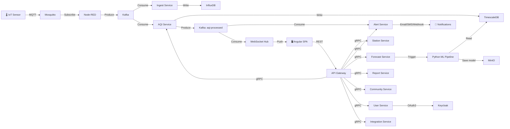

# Architecture — Urban Air Quality Platform

## 1. Tổng quan hệ thống

Nền tảng giám sát chất lượng không khí đô thị, gồm **10 microservices Go** + **ML Pipeline Python** + **Node-RED IoT**, giao tiếp qua gRPC (nội bộ), REST + WebSocket (frontend), MQTT (IoT sensor), Kafka (event streaming).

```
                            ┌──────────────┐
                            │   Frontend   │
                            │ Angular SPA  │
                            │  :4200       │
                            └──────┬───────┘
                                   │
                          REST / WS / MQTT-WS
                                   │
                            ┌──────▼───────┐
                            │ API Gateway  │
                            │  Go + Gin    │
                            │  :8080       │
                            └──────┬───────┘
                                   │ gRPC
              ┌────────┬───────┬───┴───┬────────┬────────┐
              ▼        ▼       ▼       ▼        ▼        ▼
         Station    AQI     Alert   Forecast  Report  Community
         Service   Service  Service  Service  Service  Service
         :50051    :50052   :50053   :50054   :50055   :50056
              │        │       │       │        │        │
              └────────┴───────┴───┬───┴────────┴────────┘
                                   │
              ┌────────┬───────────┼───────────┬──────────┐
              ▼        ▼           ▼           ▼          ▼
          Postgres   Redis      Kafka      InfluxDB    MinIO
          Timescale  :6379      :9092       :8086      :9000
          :5432

         User Service   Integration Service   Ingest Service
         :50057         :50058                (Kafka consumer)
              │
              ▼
          Keycloak (:8180)

         ┌──────────┐     ┌───────────┐
         │ Mosquitto │────▶│  Node-RED  │────▶ Kafka
         │ :1883     │     │  :1880     │
         └─────▲─────┘     └───────────┘
               │
          IoT Sensors
```

---

## 2. Quyết định thiết kế

| Quyết định | Lựa chọn | Lý do |
|---|---|---|
| Ngôn ngữ Backend | **Go** | Hiệu năng cao, concurrency tốt cho IoT realtime |
| HTTP Framework | **Gin** | Phổ biến nhất Go ecosystem, middleware rich |
| Inter-service comm | **gRPC** | Type-safe, streaming, nhanh hơn REST 10x |
| Frontend → Backend | **REST + WebSocket** | REST cho CRUD, WS cho push realtime |
| IoT Protocol | **MQTT** (Mosquitto) | Standard IoT, QoS, lightweight cho sensor |
| IoT Workflow | **Node-RED** | Low-code, visual flow cho validate/enrich sensor data |
| Event Streaming | **Apache Kafka** | Throughput cao, replay, decouple services |
| Time-series DB | **TimescaleDB** | SQL-compatible, hypertable, continuous aggregates |
| Raw Sensor Store | **InfluxDB** | Tối ưu cho write-heavy time-series, 30-day retention |
| Relational DB | **PostgreSQL** | JSONB, mature, TimescaleDB extension |
| Cache | **Redis** | Station metadata cache, pub-sub, session store |
| Object Storage | **MinIO** | S3-compatible cho reports, ML models, uploads |
| Auth/SSO | **Keycloak** | OAuth2, RBAC, user federation, TOTP |
| ML Training | **Python** (TF, XGBoost, Prophet) | Hệ sinh thái ML phong phú nhất |
| ETL Pipeline | **KNIME + Orange** | Visual workflow, batch processing, anomaly detection |
| Monitoring | **Prometheus + Grafana** | Standard cloud-native observability |

---

## 3. 10 Microservices

| # | Service | Port | Trách nhiệm |
|---|---------|------|-------------|
| 1 | **api-gateway** | 8080 | Entry point duy nhất, routing, auth JWT, rate limit, WebSocket hub |
| 2 | **station-service** | 50051 | CRUD trạm & sensor, trạng thái kết nối, bảo trì |
| 3 | **aqi-service** | 50052 | Tính AQI (QCVN 05:2023), lịch sử, thống kê, ghi TimescaleDB |
| 4 | **alert-service** | 50053 | Đánh giá ngưỡng, tạo cảnh báo, gửi notification đa kênh |
| 5 | **forecast-service** | 50054 | Phục vụ dự báo AQI, quản lý ML models, trigger training |
| 6 | **report-service** | 50055 | Sinh báo cáo PDF/Excel, PivotGrid, analytics, cron jobs |
| 7 | **community-service** | 50056 | Phản ánh cộng đồng, tra cứu, workflow xử lý |
| 8 | **user-service** | 50057 | Quản lý user, RBAC, tích hợp Keycloak, audit log |
| 9 | **integration-service** | 50058 | API keys, webhooks, import dữ liệu ngoài (weather, satellite) |
| 10 | **ingest-service** | — | Kafka consumer: đọc sensor data → ghi InfluxDB + TimescaleDB |

---

## 4. Sơ đồ giao tiếp



---

## 5. Luồng dữ liệu chính

### 5.1 Sensor Data Pipeline

```
Sensor → MQTT → Mosquitto → Node-RED (validate + enrich via Redis)
       → Kafka [sensor-raw-data]
       → Ingest Service → InfluxDB (raw, 30 days)
       → AQI Service → tính AQI → TimescaleDB (processed)
       → Kafka [aqi-processed]
       → Alert Service → check thresholds → notify
       → WebSocket Hub → push to Frontend
```

### 5.2 Alert Flow

```
AQI value vượt ngưỡng (sustained N minutes)
  → Alert Service tạo Alert record (PostgreSQL)
  → Kafka [alert-events]
  → WebSocket push → Frontend toast notification
  → Email (SMTP) → Cán bộ phụ trách
  → SMS (Gateway) → Cán bộ trực (nếu critical/emergency)
  → Webhook (HTTP POST) → Đối tác tích hợp
  → Push Notification (PWA) → Người dân đăng ký
```

### 5.3 Forecast Flow

```
Cron (hàng ngày 00:00)
  → KNIME ETL: lấy 30 ngày data + weather → CSV
  → Python ML (LSTM/XGBoost/Prophet): train + predict
  → Export predictions → MinIO + TimescaleDB
  → Frontend GET /forecast → hiển thị biểu đồ + confidence interval
```

### 5.4 Community Report Flow

```
Người dân submit form (không cần đăng nhập)
  → POST /community/reports (images → MinIO)
  → Cán bộ nhận notification → phân loại → giao việc
  → Timeline xử lý: Tiếp nhận → Phân loại → Giao việc → Xử lý → Đóng
  → Người dân tra cứu bằng mã → xem trạng thái + timeline
```

---

## 6. Giao thức theo module

| Module | REST | WebSocket | MQTT | gRPC | Kafka | File |
|--------|:----:|:---------:|:----:|:----:|:-----:|:----:|
| Quản lý Trạm | ✅ | ✅ status | ✅ heartbeat | ✅ | ✅ | — |
| Thu thập Sensor | ✅ import | ✅ progress | ✅ data | — | ✅ | ✅ CSV |
| Giám sát AQI | ✅ | ✅ realtime | — | ✅ | ✅ | — |
| Bản đồ | ✅ | ✅ markers | — | — | — | — |
| Cảnh báo | ✅ | ✅ live | — | ✅ | ✅ | — |
| Dự báo AI/ML | ✅ | ✅ training | — | ✅ | ✅ | ✅ model |
| Báo cáo | ✅ | — | — | ✅ | — | ✅ PDF/Excel |
| Phản ánh CĐ | ✅ | — | — | ✅ | — | ✅ images |
| Người dùng | ✅ | — | — | ✅ | ✅ audit | — |
| Tích hợp API | ✅ | — | ✅ public | ✅ | ✅ webhook | — |

---

## 7. Infrastructure Stack

```
┌─────────────────────────────────────────────────────┐
│                    FRONTEND                          │
│  Angular 17 · DevExtreme · Leaflet · Deck.gl · D3   │
├─────────────────────────────────────────────────────┤
│                  API GATEWAY                         │
│  Go + Gin · JWT · Rate Limit · WebSocket Hub         │
├─────────────────────────────────────────────────────┤
│               MICROSERVICES (Go + gRPC)              │
│  Station · AQI · Alert · Forecast · Report           │
│  Community · User · Integration · Ingest             │
├─────────────────────────────────────────────────────┤
│                 ML PIPELINE                          │
│  Python · TensorFlow · XGBoost · Prophet · KNIME     │
├─────────────────────────────────────────────────────┤
│                 IOT LAYER                            │
│  Mosquitto MQTT · Node-RED                           │
├─────────────────────────────────────────────────────┤
│               EVENT STREAMING                        │
│  Apache Kafka · Zookeeper                            │
├─────────────────────────────────────────────────────┤
│                 DATA LAYER                           │
│  PostgreSQL + TimescaleDB · InfluxDB · Redis · MinIO │
├─────────────────────────────────────────────────────┤
│               AUTH & SECURITY                        │
│  Keycloak · JWT · OAuth2 · RBAC                      │
├─────────────────────────────────────────────────────┤
│               OBSERVABILITY                          │
│  Prometheus · Grafana · Structured Logging (slog)    │
├─────────────────────────────────────────────────────┤
│               DEPLOYMENT                             │
│  Docker Compose (dev) · Kubernetes (prod) · Nginx    │
└─────────────────────────────────────────────────────┘
```
