# Urban Air Quality Platform

Nền tảng giám sát chất lượng không khí thông minh tích hợp AI/ML dự báo ô nhiễm — phục vụ 12 nghiệp vụ cốt lõi: Dashboard AQI, Giám sát Realtime, Bản đồ & 3D, Cảnh báo & Thông báo, Dự báo AI/ML, Phân tích & Báo cáo, Quản lý Trạm IoT, Nguồn Ô nhiễm, Phản ánh Cộng đồng, Quản lý Người dùng & RBAC, Tích hợp API Partner, Cấu hình Hệ thống.

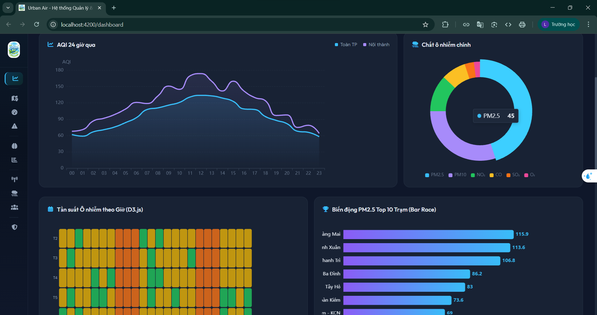 
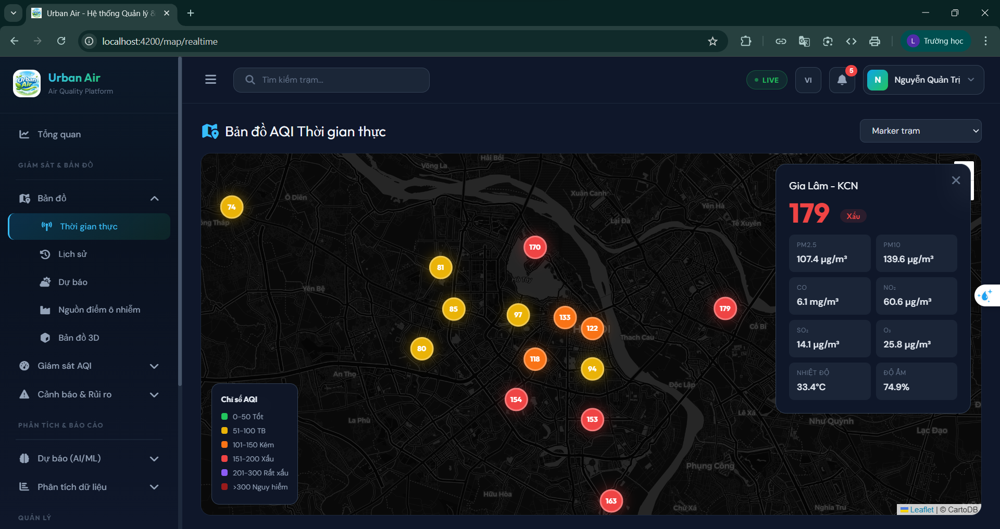 
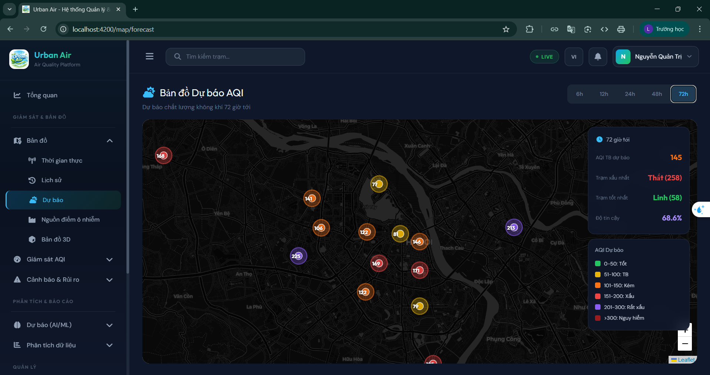 
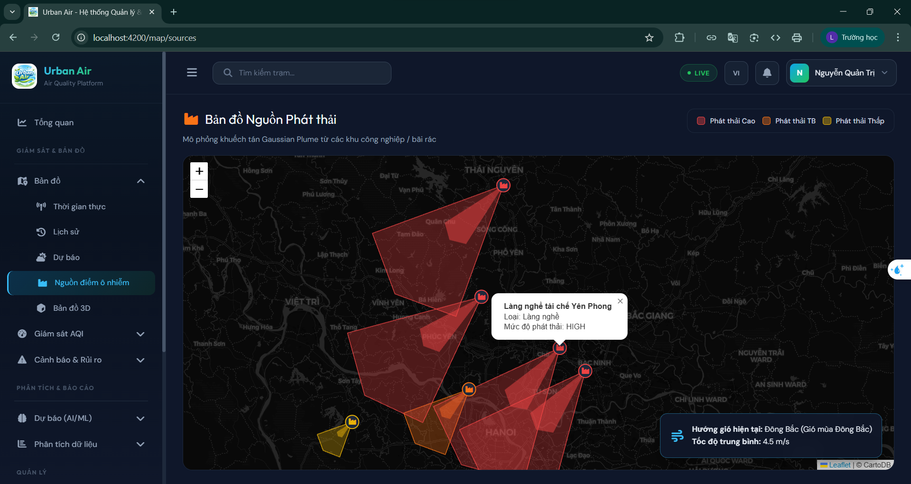 
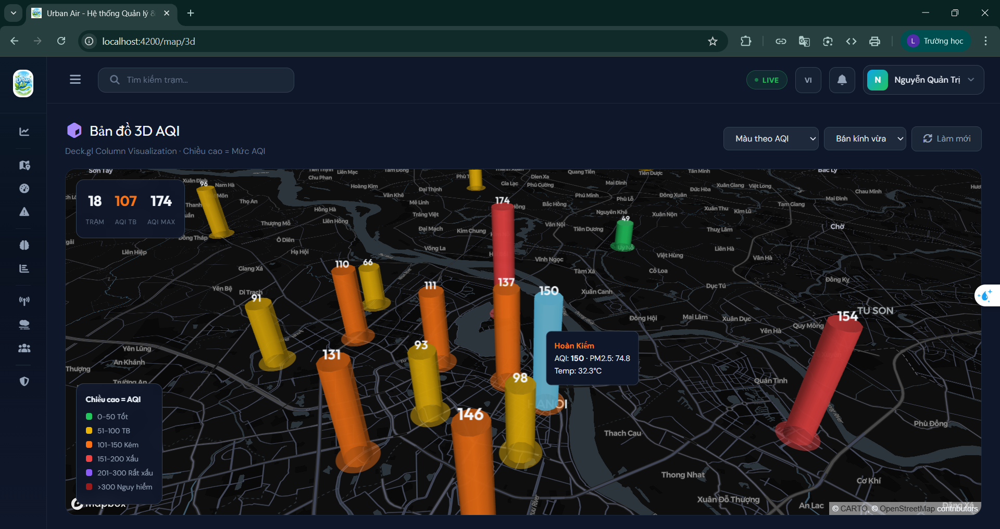 
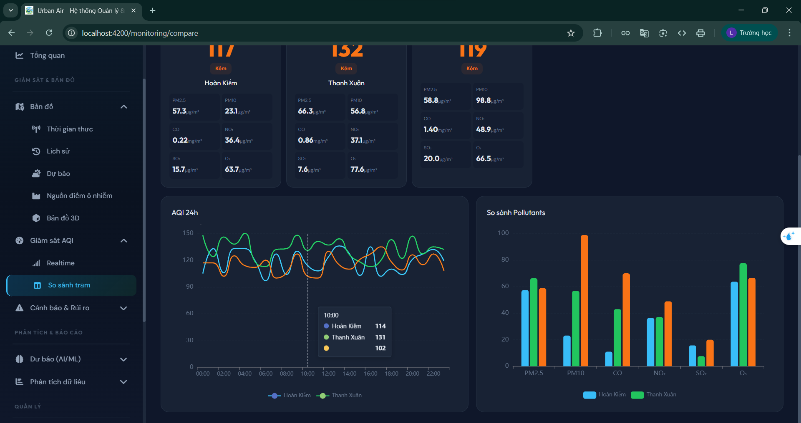 
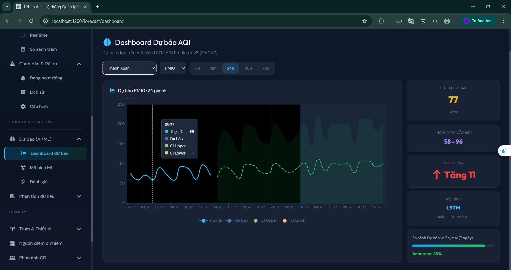 
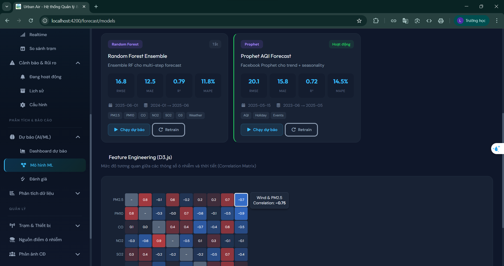 
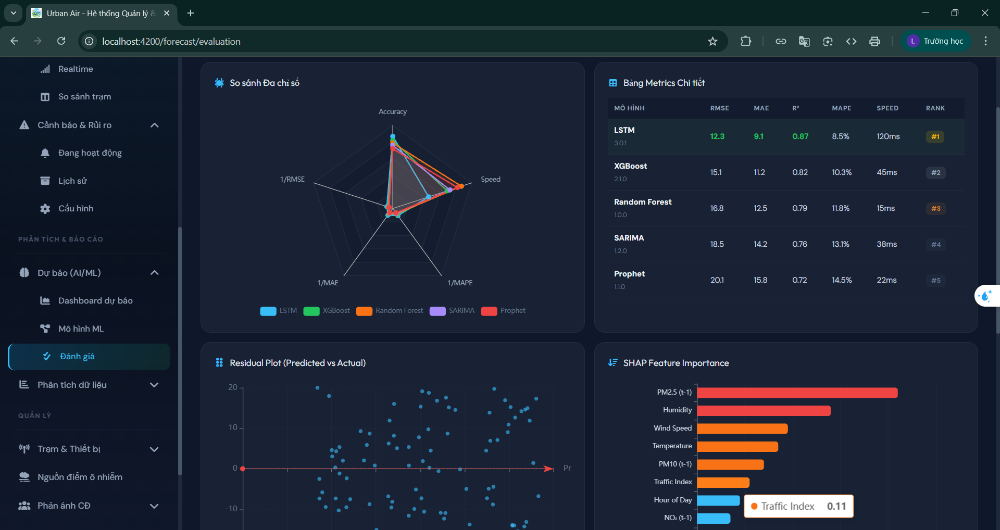 
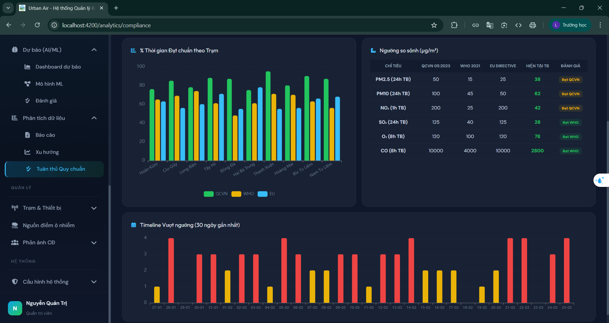 
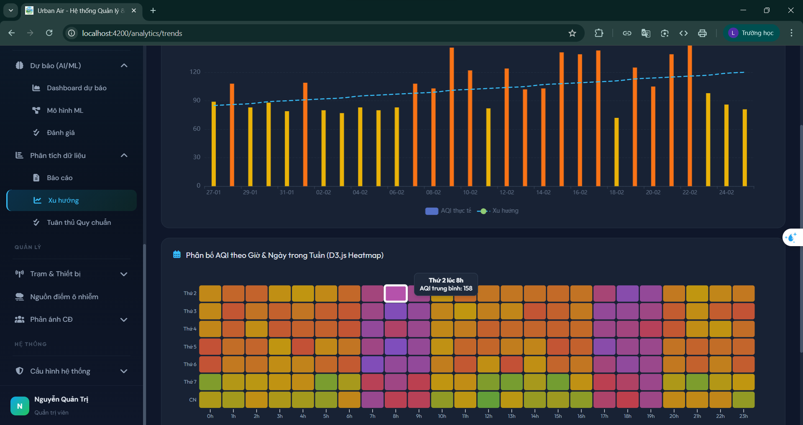 
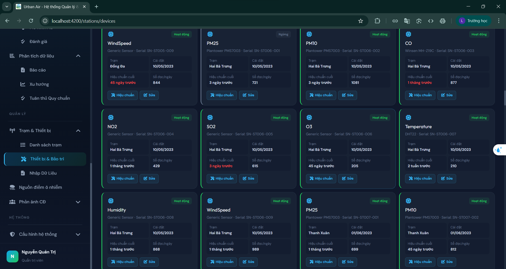 
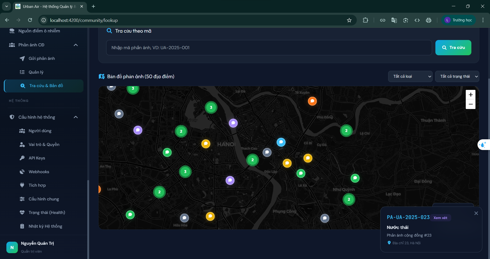 
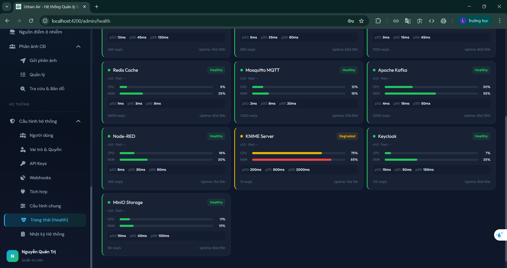 


**Frontend** chạy độc lập bằng mock data, sẵn sàng kết nối **10 microservices** backend chỉ bằng 1 dòng config.

```
Tech Stack
├── Frontend:   Angular 17 · DevExtreme · PrimeNG · D3.js · Leaflet · Deck.gl
│               ECharts · NgRx · MQTT.js · RxJS · TypeScript · SCSS · Signals
└── Backend:    Go 1.22 · Gin · gRPC · Gorilla WebSocket
                Apache Kafka · Mosquitto MQTT · Node-RED
                PostgreSQL · TimescaleDB · InfluxDB · Redis · MinIO
                Python 3.12 · TensorFlow · XGBoost · Prophet · KNIME · Orange
                Keycloak · Docker · Kubernetes · Prometheus · Grafana
```

---

## Tài liệu

```
READ FIRST/                  Đọc trước khi làm bất cứ việc gì
├── architecture.md             10 microservices, quyết định thiết kế, sơ đồ giao tiếp, luồng dữ liệu
├── rbac-matrix.md              5 vai trò × 12 modules: UI sidebar · API endpoint · data filter
└── environment-window.md       Cài đặt toàn bộ môi trường trên Windows từ đầu

READ FRONTEND/               Dành cho frontend developer
├── frontend-structure.md       Cây file Angular 17, commands, mock services, 5 tài khoản demo
└── mock-data.md                20 trạm, 100 cảnh báo, 200 phản ánh, 5 ML models, seed data

READ BACKEND/                Dành cho backend developer
├── backend-structure.md        10 microservices Go, ports REST + gRPC, package layout chuẩn
├── api-contracts.md            60+ endpoints REST, JSON schema, pagination, error codes, webhook
├── database-schema.md          PostgreSQL DDL, TimescaleDB hypertable, InfluxDB, ER diagram
├── grpc-contracts.md           6 proto files, 25+ RPC methods, timeout, circuit breaker config
└── mqtt-kafka-events.md        MQTT topics + payload, 8 Kafka topics, partition, DLQ config

READ DEPLOY/                 Dành cho DevOps / người cài đặt
├── docker-compose.md           Toàn bộ hạ tầng 1 file: Postgres + Kafka + Redis + MQTT + MinIO
├── coding-conventions.md       Quy tắc code Go · Angular · Python · Git, PR checklist
├── testing-guide.md            Pyramid 70/20/5/5, coverage targets, Testcontainers, k6, Cypress
└── troubleshooting.md          Debug startup · runtime · Docker · MQTT · Kafka · symptom checklist
```

---

## Chạy nhanh (chỉ Frontend)

```bash
cd frontend
npm install --legacy-peer-deps
npx ng serve
```

Mở http://localhost:4200 — đăng nhập bằng username và password bất kỳ.

**5 tài khoản demo:**

| Username | Role | Trang mặc định |
|---|---|---|
| `admin` | Quản trị viên | Dashboard + toàn bộ hệ thống |
| `expert` | Chuyên gia môi trường | Dashboard + Dự báo AI/ML |
| `operator` | Cán bộ vận hành | Giám sát AQI + Cảnh báo |
| `manager` | Lãnh đạo | Dashboard + Báo cáo tổng hợp |
| `citizen` | Người dân | Gửi & tra cứu phản ánh (không đăng nhập) |

---

## Kết nối Backend

Frontend hiện dùng mock data nội bộ. Khi backend sẵn sàng, kết nối bằng cách:

### Bước 1 — Sửa environment

```typescript
// src/environments/environment.ts
export const environment = {
  production: false,
  useMockData: false,          // ← đổi thành false
  apiUrl: 'http://localhost:8080',
  wsUrl: 'ws://localhost:8080',
  mqttUrl: 'ws://localhost:9001'
};
```

### Bước 2 — Tắt Mock Interceptor

```typescript
// src/app/app.config.ts
// Xóa hoặc comment dòng import MockInterceptor:
// { provide: HTTP_INTERCEPTORS, useClass: MockInterceptor, multi: true }
```

### Bước 3 — Khởi động Backend Infrastructure

```bash
cd backend
docker-compose -f docker-compose.dev.yml up -d
```

Lệnh này tự động chạy toàn bộ 12 containers: PostgreSQL + TimescaleDB, InfluxDB, Redis, Kafka, Zookeeper, Mosquitto MQTT, MinIO, Keycloak, Node-RED, Prometheus, Grafana.

### Bước 4 — Chạy API Gateway + Microservices

```bash
# Terminal 1: API Gateway (entry point duy nhất cho Frontend)
cd backend/api-gateway && go run cmd/server/main.go
# → http://localhost:8080

# Terminal 2-9: Các microservices (giao tiếp qua gRPC nội bộ)
cd backend/station-service && go run cmd/server/main.go    # :50051
cd backend/aqi-service && go run cmd/server/main.go        # :50052
cd backend/alert-service && go run cmd/server/main.go      # :50053
cd backend/forecast-service && go run cmd/server/main.go   # :50054
cd backend/report-service && go run cmd/server/main.go     # :50055
cd backend/community-service && go run cmd/server/main.go  # :50056
cd backend/user-service && go run cmd/server/main.go       # :50057
cd backend/integration-service && go run cmd/server/main.go # :50058
cd backend/ingest-service && go run cmd/server/main.go     # Kafka consumer
```

### Bước 5 — Chạy ML Pipeline (khi cần dự báo)

```bash
cd backend/ml-pipeline
pip install -r requirements.txt
python -m src.training.trainer
```

### Bước 6 — Seed dữ liệu mẫu

```bash
cd backend
./scripts/run-migrations.sh    # Tạo bảng
./scripts/seed-data.sh         # Insert 20 trạm, 100 cảnh báo, 200 phản ánh...
```

### Kiểm tra kết nối

```
Frontend:     http://localhost:4200
API Gateway:  http://localhost:8080/api/v1/system/health
Swagger:      http://localhost:8080/swagger/
Keycloak:     http://localhost:8180
Node-RED:     http://localhost:1880
MinIO:        http://localhost:9001
InfluxDB:     http://localhost:8086
Grafana:      http://localhost:3000
```

### Mapping Frontend Service ↔ Backend

| Frontend Service | Backend | Giao thức | Endpoint |
|---|---|---|---|
| `auth.service.ts` | user-service → Keycloak | REST | `/api/v1/auth/*` |
| `station.service.ts` | station-service | REST | `/api/v1/stations/*` |
| `aqi.service.ts` | aqi-service | REST + WS | `/api/v1/aqi/*` + `/ws/aqi-realtime` |
| `alert.service.ts` | alert-service | REST + WS | `/api/v1/alerts/*` + `/ws/alerts-live` |
| `webhook.service.ts` | integration-service | REST | `/api/v1/webhooks/*` |
| `mqtt.service.ts` | Mosquitto | MQTT/WS | `ws://localhost:9001` |
| `export.service.ts` | — (client-side) | — | Không cần backend |

